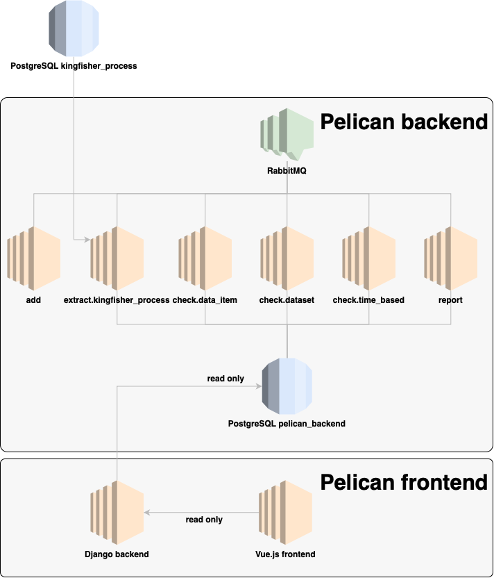

Overview
========

Goals
-----

Pelican is focused on data quality. It supports an interrogation of the quality of a dataset, rather than an exploration of the data that it contains. As such, it is not designed to support many features that are more appropriate to exploration.

It is also focused on *intrinsic* quality rather than *extrinsic* quality. That said, it can include intrinsic metrics that are easy to calculate (like the number of contracting processes) to support extrinsic metrics (like the proportion of all contracts covered by the dataset).

.. _worker-design:

Worker design
-------------

Workers communicate via a :ref:`rabbitmq` exchange to extract and assess OCDS data, writing the results to a :ref:`postgresql` database.

Workers can be daemonized and run in parallel. The pipeline is:

#. An :ref:`extract<workers-extract>` worker extracts a collection and its compiled releases. It publishes the IDs of the items in batches.
#. The :ref:`check-data-item` worker performs the field-level and compiled release-level checks. After each batch is processed, it publishes the ID of the dataset.
#. The :ref:`check-dataset` worker determines whether field-level and compiled release-level checks have been performed on all items. If so, it performs the dataset-level checks. After, it publishes the ID of the dataset.
#. The :ref:`check-time-based` worker performs the time-based checks. After, it publishes the ID of the dataset.
#. The :ref:`report` worker creates field-level and compiled release-level reports, picks field-level and compiled release-level examples, and updates the dataset's metadata.

Workers are `Click <https://click.palletsprojects.com/>`__ programs that are:

-  as stateless as possible, since messages can arrive in any order
-  as idempotent as possible, since messages can be re-delivered
-  able to run in parallel, to maximize throughput

.. _repository-structure:

Repository structure
--------------------

.. code-block:: none

   ├── contracting_process    Field-level and compiled release-level checks
   │   ├── field_level           Field-level checks
   │   │   └── checks               Individual checks
   │   └── resource_level        Compiled release-level checks
   │       ├── coherent             Coherence checks
   │       ├── consistent           Consistency checks
   │       └── reference            Reference checks
   ├── dataset                Dataset-level checks
   │   ├── consistent            Consistency checks
   │   ├── distribution          Distribution checks
   │   ├── misc                  Miscellaneous checks
   │   ├── reference             Reference checks
   │   └── unique                Uniqueness checks
   ├── pelican                The main project
   │   ├── migrations            Database migrations
   │   └── static                Static files (SQL dumps, SQL snippets, etc.)
   ├── time_variance          Time-based checks
   │   └── checks                Individual checks
   ├── tools                  Shared utilities
   └── workers                :doc:`All workers<reference/workers>`
       ├── extract               Extractor workers
       └── check                 Checker workers

..
   tree -d -I '__pycache__|tests|htmlcov|docs'

   Replace the non-breaking spaces with normal spaces.

Pelican frontend integration
----------------------------

Pelican backend (*DQT* in the diagram) and `Pelican frontend <https://pelican-frontend.readthedocs.io/en/latest/>`__ (*DQV*) are composed as in this image:

.. https://app.diagrams.net/?page-id=eUBU3am9u6r-Z2GVQuAO#G10GykQCg41pxzQglRFYs2aa4OPHz-ivCS
