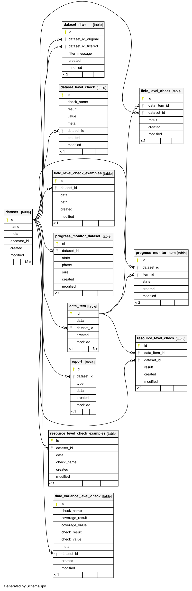
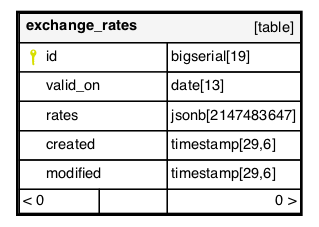

Services
========

.. _rabbitmq:

RabbitMQ
--------

This project uses a direct exchange in the same way as the `default exchange <https://www.rabbitmq.com/tutorials/amqp-concepts.html#exchange-default>`__, in which every queue is bound using a routing key that is the same as the queue's name.

In each worker, the queue name and binding key is set by ``consume_routing_key``, and the routing key of published messages is set by ``routing_key``. Queue names and routing keys are prefixed by the exchange name, set by the ``RABBIT_EXCHANGE_NAME`` environment variable.

For design decisions relating to RabbitMQ, see the `Software Development Handbook <https://ocp-software-handbook.readthedocs.io/en/latest/services/rabbitmq.html#design-decisions>`__.

Having trouble? See :doc:`../tasks/troubleshoot`.

.. list-table::
   :header-rows: 1

   * - Worker/Command
     - Queue (input)
     - Message routing key (output)
     - Sample message
   * - ``core.starter``
     - N/A
     - ``ocds_kingfisher_extractor_init``
     - :ref:`add-dataset`
   * - ``extractor.ocds_kingfisher``
     - ``ocds_kingfisher_extractor_init``
     - ``extractor``
     - ``{"dataset_id": 1, "item_ids": [1,2,3]}``
   * - ``extractor.dataset_filter``
     - ``dataset_filter_extractor_init``
     - ``extractor``
     - ``{"dataset_id": 1, "item_ids": [1,2,3]}``
   * - ``checker.contracting_process``
     - ``extractor``
     - ``contracting_process_checker``
     - ``{"dataset_id": 123}``
   * - ``checker.dataset``
     - ``contracting_process_checker``
     - ``dataset_checker``
     - ``{"dataset_id": 123}``
   * - ``checker.time_variance``
     - ``dataset_checker``
     - ``time_variance_checker``
     - ``{"dataset_id": 123}``
   * - ``core.finisher``
     - ``time_variance_checker``
     - N/A
     - N/A
   * - ``core.wiper``
     - ``wiper_init``
     - N/A
     - N/A

.. _postgresql:

PostgreSQL
----------

Tables
~~~~~~

.. list-table::
   :header-rows: 1

   * - Table
     - Description
     - ``INSERT``
     - ``SELECT``
   * - ``dataset``
     - Imported collections
     - ``extractor``
     - ``extractor/dataset_filter``, ``dataset/meta_data_aggregator``, ``time_variance/processor``
   * - ``data_item``
     - Imported compiled releases
     - ``extractor``
     - ``checker/contracting_process``, ``dataset/processor``, ``time_variance/processor``
   * - ``field_level_check``
     - Field-level check results
     - ``contracting_process/processor``
     - ``contracting_process/field_level/report_examples``
   * - ``field_level_check_examples``
     - Field-level check examples
     - ``contracting_process/processor``
     - ``contracting_process/field_level/report_examples``
   * - ``resource_level_check``
     - Compiled release-level check results
     - ``contracting_process/processor``
     - ``contracting_process/resource_level/examples``, ``contracting_process/resource_level/report``
   * - ``resource_level_check_examples``
     - Compiled release-level check examples
     - ``contracting_process/processor``
     - ``contracting_process/resource_level/examples``
   * - ``dataset_level_check``
     - Dataset-level check results
     - ``dataset/processor``
     - N/A
   * - ``time_variance_level_check``
     - Time-based check results
     - ``time_variance/processor``
     - N/A
   * - ``progress_monitor_dataset``
     - Progress of datasets' processing (see :doc:`state-machine`)
     - ``extractor``, ``checker``, ``core/finisher``
     - ``extractor/dataset_filter``, ``checker/dataset``
   * - ``progress_monitor_item``
     - Progress of items' processing (see :doc:`state-machine`)
     - ``extractor``, ``contracting_process/processor``
     - ``checker/dataset``

.. See https://ocp-software-handbook.readthedocs.io/en/latest/services/postgresql.html#entity-relationship-diagram and use relationships.real.large.png

